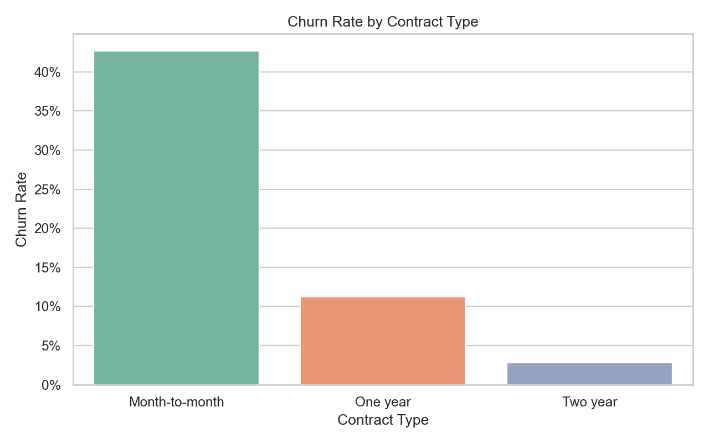
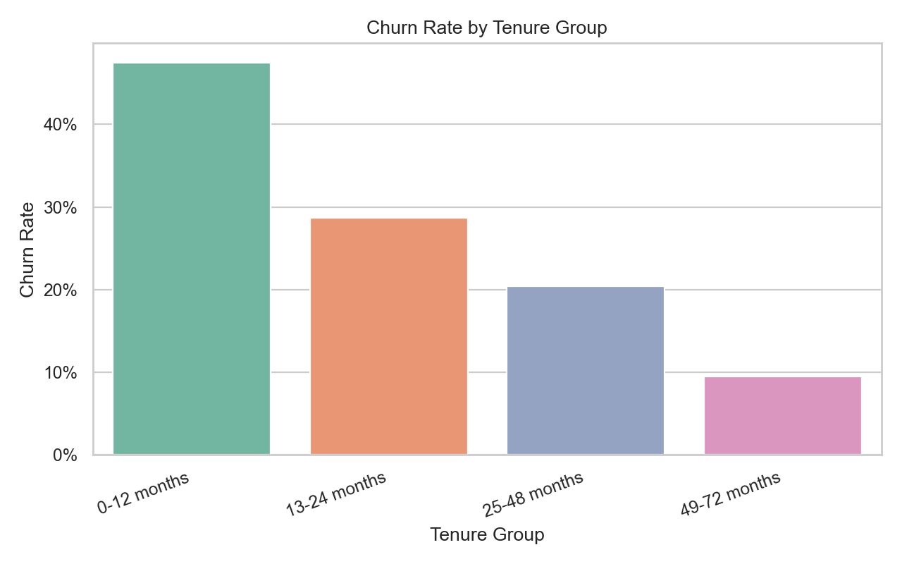
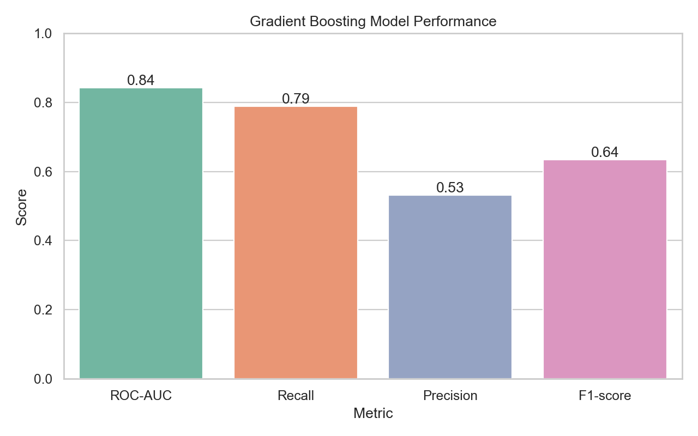

# Customer Churn Prediction

Machine learning project to predict customers who are likely to churn using the Telco Customer Churn dataset.

## Goal

Build a classification model that helps business teams identify high-risk customers and prioritize retention campaigns.

## What Is Churn?

Customer churn happens when a customer stops using a product or service. In this project, churn means a Telco customer has ended their subscription.

Churn is important because losing existing customers can reduce recurring revenue and increase acquisition costs. It is usually more expensive to acquire a new customer than to retain an existing one, so identifying churn risk early helps the business take action before the customer leaves.

A churn prediction model helps answer questions such as:

```text
- Which customers are most likely to leave?
- What customer behaviors are linked to churn?
- Which customer segments should receive retention campaigns first?
- How can the business reduce revenue loss from customer churn?
```

## Dataset

Dataset used:

```text
Telco Customer Churn
Raw file: projects/churn_prediction/data/raw/telco_customer_churn.csv
Processed file: projects/churn_prediction/data/processed/churn_clean.csv
```

The raw and processed datasets are stored locally and ignored by git.

## Dataset Decision

This project initially explored an e-commerce churn dataset, but the dataset did not provide strong predictive signal for valid churn modeling. Some public notebooks achieved very high scores by using subscription status as both a feature and the target, which creates data leakage.

The project was rebuilt with the Telco Customer Churn dataset because it provides clearer churn labels and stronger business features such as tenure, contract type, monthly charges, payment method, and service usage.

## Workflow

1. Load Telco customer churn dataset
2. Clean and standardize columns
3. Convert `TotalCharges` to numeric
4. Create churn target `is_churned`
5. Engineer customer and billing features
6. Explore churn patterns with EDA visualizations
7. Train multiple classification models
8. Tune decision threshold for churn detection
9. Translate model results into business recommendations

## Current Results

Best model so far:

```text
Model: Gradient Boosting
ROC-AUC: 0.8435
Default threshold recall churn: 0.5134
Selected threshold: 0.28
Selected threshold recall churn: 0.7888
Selected threshold precision churn: 0.5315
Selected threshold F1 churn: 0.6351
```

Business interpretation:

```text
Customers with month-to-month contracts, short tenure, high monthly charges,
and electronic check payment are more likely to churn.
```

## Key Visuals

The EDA and modeling results highlight the main churn risk patterns and the current model performance.

### Churn by Contract Type

Month-to-month customers have the highest churn rate, making them a priority segment for retention campaigns.



### Churn by Tenure Group

Newer customers are more likely to churn, especially within the first 12 months.



### Model Performance

The Gradient Boosting model achieves strong ranking performance with ROC-AUC above 0.80 and recall near 0.79 at the selected threshold.



## Interactive Dashboard

This project includes an interactive Dash dashboard for exploring churn patterns and testing customer churn risk scenarios.

The dashboard provides:

- KPI cards for total customers, churned customers, retained customers, churn rate, and average monthly charges.
- Interactive filters for contract type, tenure group, payment method, and internet service.
- Churn rate charts by contract, tenure group, payment method, and internet service.
- A churn risk prediction form powered by the trained Gradient Boosting model.
- Business-friendly prediction output with simple risk labels and recommended retention actions.

Run the dashboard:

```powershell
uv run python projects/churn_prediction/dashboard/app.py
```

Open in browser:

```text
http://127.0.0.1:8051/
```

The dashboard uses the local model artifact:

```text
projects/churn_prediction/models/churn_gradient_boosting.joblib
```

The model artifact is intentionally not committed to GitHub. Recreate it by running:

```powershell
uv run python projects/churn_prediction/src/train_model.py
```

## Main Files

```text
Data preparation:
projects/churn_prediction/src/prepare_data.py

EDA notebook:
projects/churn_prediction/notebooks/churn_eda.ipynb

Modeling notebook:
projects/churn_prediction/notebooks/churn_modeling.ipynb

Training script:
projects/churn_prediction/src/train_model.py

Evaluation report:
projects/churn_prediction/reports/evaluation_summary.md
```

## Run Data Preparation

```powershell
uv run python projects/churn_prediction/src/prepare_data.py
```

## Run Model Training

```powershell
uv run python projects/churn_prediction/src/train_model.py
```

This creates a local ignored model artifact and a tracked evaluation report.

## Progress Checklist

```text
[x] Replace e-commerce churn dataset with Telco Customer Churn dataset
[x] Clean and standardize Telco columns
[x] Create processed dataset
[x] Create churn target `is_churned`
[x] Add feature engineering columns
[x] Rebuild EDA notebook for Telco dataset
[x] Rebuild modeling notebook for Telco dataset
[x] Compare multiple baseline models
[x] Achieve valid ROC-AUC above 0.80 without data leakage
[x] Add threshold tuning for churn recall
[x] Save best model to models/ (local, ignored by git)
[x] Create evaluation report
[ ] Update Django project detail page
[x] Add portfolio-ready screenshots/figures
[x] Create interactive churn dashboard with prediction form
```
