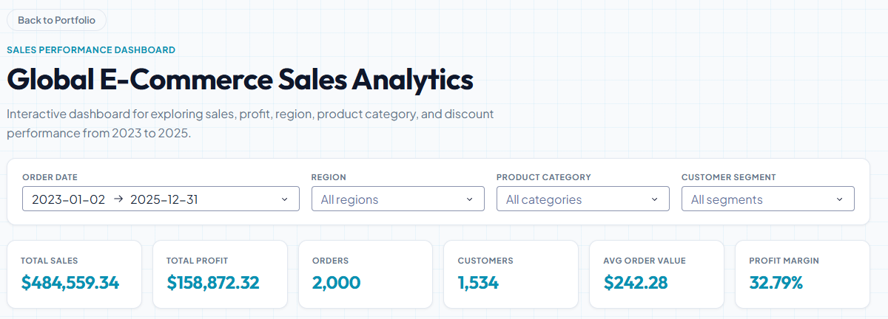
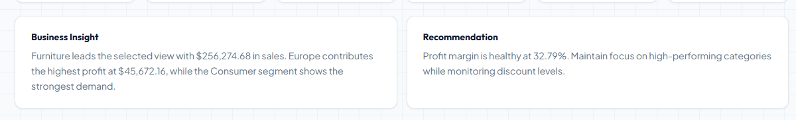
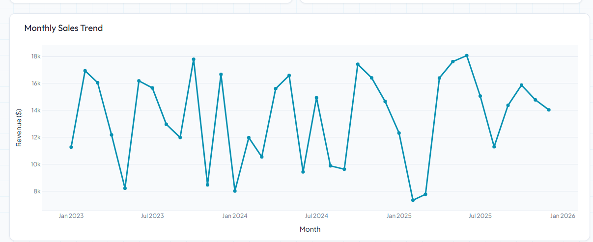
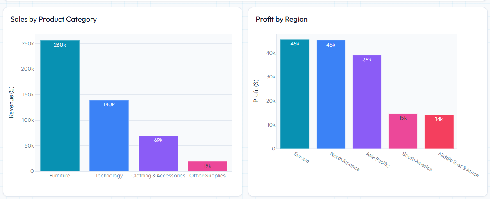
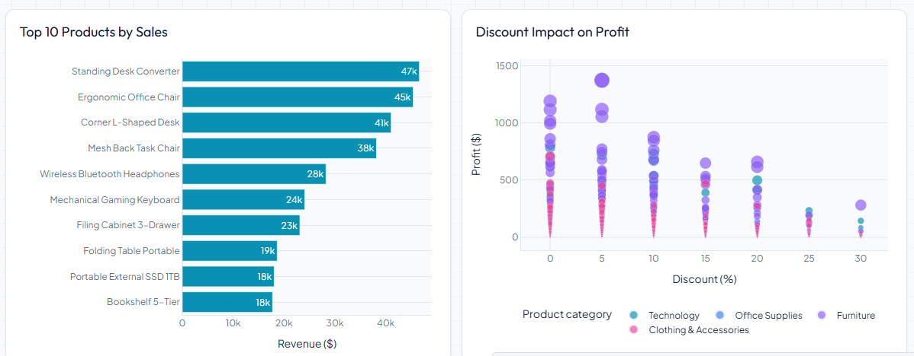

# Sales Performance Dashboard

Project ini membangun dashboard penjualan berbasis data e-commerce. Tujuannya bukan hanya membuat chart, tetapi menunjukkan alur data science sederhana dari data mentah sampai insight bisnis yang bisa ditampilkan di portfolio Django.

## Goal

```text
Raw e-commerce data
-> data cleaning
-> feature engineering
-> processed dataset
-> interactive Dash dashboard
-> case study page di Django portfolio
```

## Dashboard Preview

The dashboard is designed as a business intelligence case study, not only a chart collection. It highlights KPI performance, filterable business views, and recommendations that connect analysis to decision making.



### Business Insight



### Analytical Views







## Dataset

Gunakan dataset e-commerce sales yang lebih baru agar portfolio terasa relevan.

Rekomendasi dataset:

```text
Multi-Source Data for E-Commerce Sales Prediction
Kaggle: https://www.kaggle.com/datasets/algozee/multi-source-data-for-e-commerce-sales-prediction
```

Alternatif:

```text
Global E-Commerce Sales Dataset 2025
Kaggle: https://www.kaggle.com/datasets/kojibrand/global-e-commerce-sales-dataset-2025
```

## Download Data

1. Buka halaman dataset Kaggle.
2. Download file CSV.
3. Rename file menjadi:

```text
ecommerce_sales.csv
```

4. Simpan ke:

```text
projects/sales_dashboard/data/raw/ecommerce_sales.csv
```

Folder `data/raw/` tidak perlu diupload ke git karena dataset bisa besar dan memiliki lisensi dari Kaggle.

## Folder Structure

```text
projects/sales_dashboard/
|-- data/
|   |-- raw/
|   |   `-- ecommerce_sales.csv
|   `-- processed/
|       `-- sales_clean.csv
|-- notebooks/
|   `-- sales_eda.ipynb
|-- src/
|   `-- prepare_data.py
|-- dashboard/
|   `-- app.py
|-- reports/
`-- README.md
```

## Data Preparation Plan

Script:

```text
projects/sales_dashboard/src/prepare_data.py
```

Tugas script:

```text
1. Read data/raw/ecommerce_sales.csv
2. Standardize column names
3. Parse date columns
4. Handle missing values
5. Create useful features
6. Save data/processed/sales_clean.csv
```

Feature engineering awal:

```text
order_month
order_year
order_quarter
sales_amount / revenue
profit_margin jika ada kolom profit
discount_rate jika ada kolom discount
```

## Dashboard Plan

Dash app:

```text
projects/sales_dashboard/dashboard/app.py
```

Dashboard awal:

```text
KPI cards:
- Total sales
- Total orders
- Average order value
- Total customers jika tersedia

Charts:
- Monthly sales trend
- Sales by category
- Sales by country/region
- Top products

Filters:
- Region
- Product category
- Customer segment
```

## Portfolio Case Study

Halaman Django:

```text
/projects/sales-dashboard/
```

Isi case study:

```text
Problem:
Business team needs a clear way to monitor sales performance and identify growth opportunities.

Approach:
Clean e-commerce transaction data, engineer time-based and business metrics, then build an interactive dashboard.

Result:
Dashboard helps users track revenue trends, top-performing products, and regional performance.
```


## Technical Workflow

```text
1. Download raw e-commerce dataset
2. Explore data in notebook
3. Clean and validate data with pandas
4. Create business-focused features
5. Save processed dataset
6. Build interactive dashboard with Dash and Plotly
7. Link dashboard from Django portfolio case study page
```

Main files:

```text
Notebook EDA:
projects/sales_dashboard/notebooks/sales_edaa.ipynb

Data preparation script:
projects/sales_dashboard/src/prepare_data.py

Processed dataset:
projects/sales_dashboard/data/processed/sales_clean.csv

Dash dashboard:
projects/sales_dashboard/dashboard/app.py
```

Run data preparation:

```powershell
uv run python projects\sales_dashboard\src\prepare_data.py
```

Run dashboard:

```powershell
uv run python projects\sales_dashboard\dashboard\app.py
```

Local dashboard URL:

```text
http://127.0.0.1:8050/
```

## Business Recommendation

The analysis shows that sales performance is mainly driven by Furniture and Technology products, while Consumer customers generate the largest revenue contribution. Europe, North America, and Asia Pacific are the strongest regional markets, showing that growth is distributed across multiple regions rather than concentrated in one area.

Discount strategy should be monitored carefully. Higher discount levels are associated with lower total profit, which suggests that broad discounting may reduce profitability instead of improving business performance.

Recommended actions:

```text
1. Prioritize Furniture and Technology products because they drive the highest sales.
2. Maintain strong regional coverage across Europe, North America, and Asia Pacific.
3. Focus retention and marketing campaigns on Consumer customers.
4. Avoid broad high-discount campaigns.
5. Use targeted discounts only for specific products, regions, or customer segments where volume can grow without damaging profit margin.
```
## Next Steps

```text
[x] Add dashboard screenshots to this README
[ ] Prepare deployment configuration
[ ] Consider embedding Dash in Django via iframe for seamless portfolio flow
```

## Progress Checklist

```text
[x] Download ecommerce sales dataset
[x] Store raw dataset locally
[x] Explore dataset in notebook
[x] Standardize column names
[x] Parse order_date
[x] Create feature engineering columns
[x] Generate business KPI summary
[x] Create EDA visualizations
[x] Add business insights / storytelling notes
[x] Build reusable data preparation script
[x] Generate processed dataset
[x] Build Dash dashboard layout
[x] Add KPI cards (Total Sales, Profit, Orders, Customers, AOV, Profit Margin)
[x] Add monthly sales trend chart
[x] Add category sales chart
[x] Add region profit chart
[x] Add top products chart
[x] Add discount impact chart
[x] Add interactive filters (Date, Region, Product Category, Customer Segment)
[x] Add dynamic business insight and recommendation text
[x] Link dashboard from Django project detail page
[x] Light mode UI polish (white panels, cyan accent, subtle grid background)
[x] Plotly charts - clean light mode with plotly_white template
[x] Proper readable axis labels on all charts (Revenue ($), Profit ($), etc.)
[x] Legend fix on Discount Impact scatter chart (moved to bottom)
[x] Back to Portfolio button in dashboard header
[x] Push to GitHub
[x] Add dashboard screenshots to README
[ ] Prepare deployment
```
